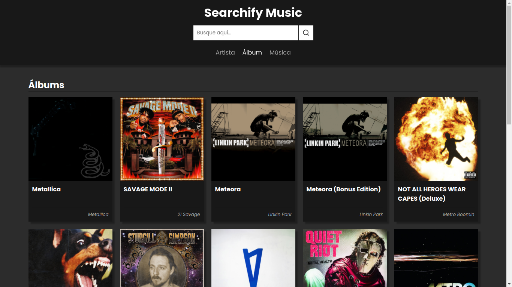

# vue-spotify-example - WIP

An example of application with Vue.js and Spotify API.

## Project for study purposes. In progress...

### [demo](https://arturguitelar.github.io/vue-spotify-example/)
- Click in "login" to validate routes.
- Search for fake data. *need to fill search input with something*
- **known bug** - Search field doesn't persist data between pages. 

## App images





## Project setup (vue basics)

```
npm install
```

### Compiles and hot-reloads for development

```
npm run serve
```

### Compiles and minifies for production

```
npm run build
```

### Run your unit tests

```
npm run test:unit
```

### Run your unit tests with jest watch

```
npm run test:unit:w
```

### Lints and fixes files

```
npm run lint
```

### Customize configuration

See [Configuration Reference](https://cli.vuejs.org/config/).
